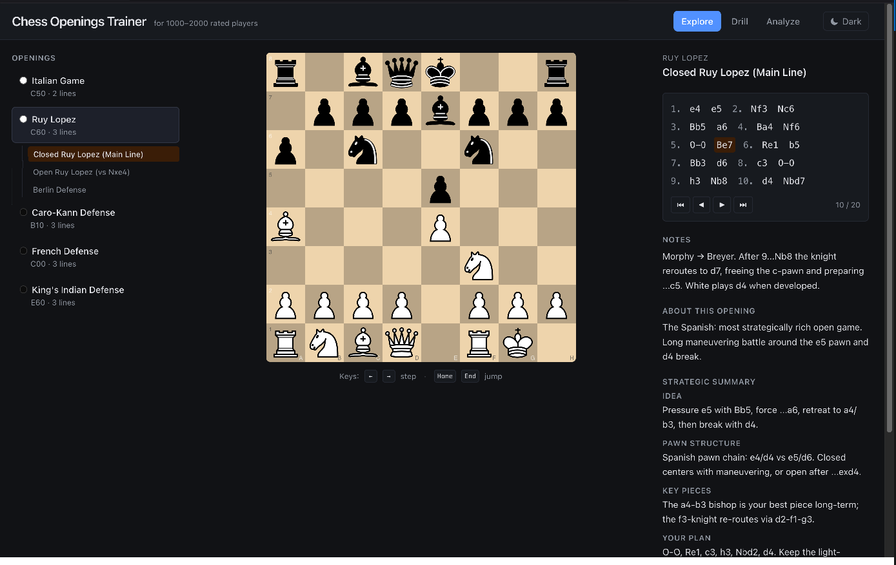
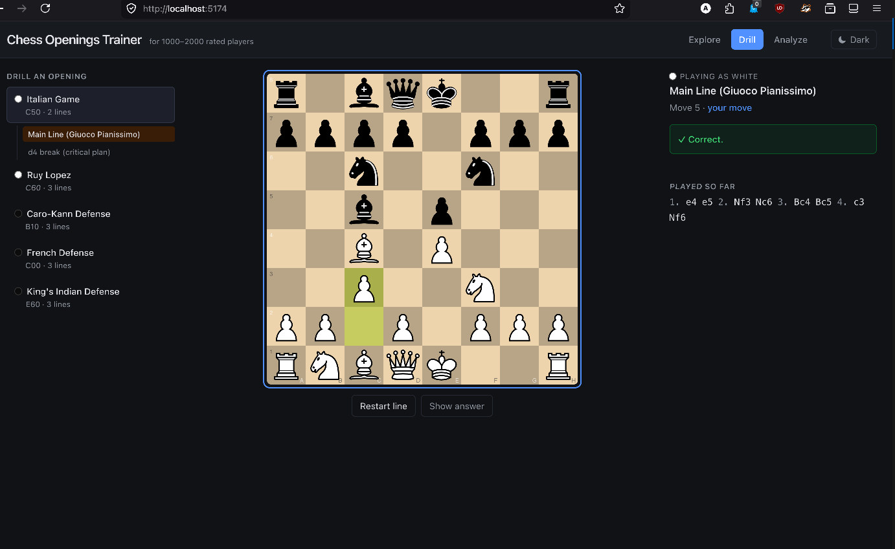

# Chess Trainer

A local-first web app for learning and drilling chess openings. **🚀 Going live soon — stay tuned!** Built with Vite + React + TypeScript, using [chessground](https://github.com/lichess-org/chessground) for the board and [chess.js](https://github.com/jhlywa/chess.js) for move logic. All data (repertoire, SRS review state) is stored locally in IndexedDB via Dexie — no server, no auth.

## Features

- **Explore** — browse opening lines on an interactive board; author your own repertoire.
- **Drill** — guided repertoire drill; the app plays the opponent, you play the reply.
- **Spaced repetition** — SM-2 scheduling over `(fen, expectedMove)` cards with a daily due queue.
- **Analyze** — step through saved lines and positions.

See [`docs/PLAN.md`](docs/PLAN.md) for the full design.

## Screenshots

### Learn / Explore


### Drill


## Getting started

```bash
cd app
npm install
npm run dev
```

Then open the URL Vite prints (typically http://localhost:5173).

## Scripts

Run from `app/`:

- `npm run dev` — start the dev server
- `npm run build` — typecheck and build for production
- `npm run preview` — preview the production build
- `npm run lint` — run ESLint
- `npm test` — run the Vitest test suite once
- `npm run test:watch` — run tests in watch mode

## Project layout

```
chess-trainer/
  app/           Vite + React app
    src/
      analyze/   Analysis view
      board/     Chessground wrapper
      drill/     Guided repertoire drill mode
      openings/  Seed opening data
      storage/   Dexie schema + repositories
      ui/        Shared UI components
  docs/          Design plan, progress notes
```

## Stack

React 19, TypeScript, Vite 8, Tailwind 4, chess.js, chessground, Dexie, Vitest.
